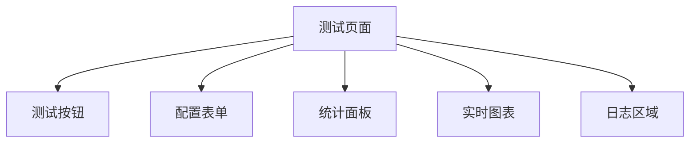
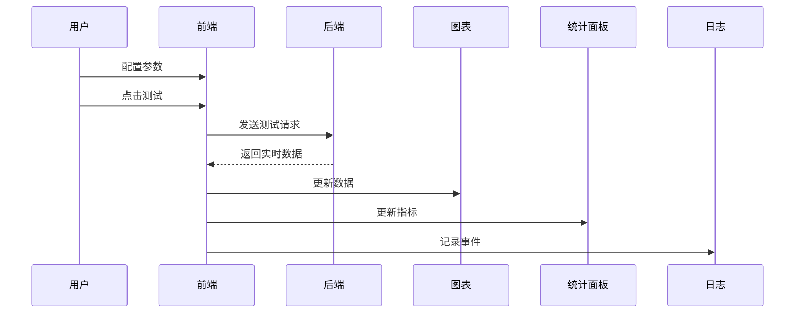

# 大模型 TPS 测试工具详细设计文档

## 1. 模块概述
基于 PRD 需求，前端模块主要实现大模型 TPS 测试的配置、执行和可视化功能。

## 2. 模块划分

### 2.1 配置模块
- **模型选择组件**：下拉选择预设模型或自定义输入
- **API 配置组件**：下拉选择预设后端类型，对应自动给出URL，或选择自定义输入。密钥输入（前端输入后不显示具体值）
- **参数设置组件**：测试时长和最大 Token 数和最小 Token 数设置

### 2.2 测试控制模块
- **测试按钮组件**：开始/停止测试的交互控制
- **状态管理**：测试状态维护和UI反馈
- **定时器管理**：测试时长控制

### 2.3 数据可视化模块
- **实时图表**：使用 Chart.js 绘制 TPS 变化曲线，。
- **统计面板**：显示关键性能指标：后端CPU占用率，GPU占用率，显存占用数值表
- **日志组件**：记录和显示测试事件

## 3. 组件设计

### 3.1 UI 组件


### 3.2 数据流


## 4. 接口定义

### 4.1 API 请求格式
```json
{
  "model": "模型名称",
  "api_url": "API地址",
  "api_key": "API密钥",
  "duration": 测试秒数,
  "max_tokens": 最大Token数，
  "min_tokens": 最小Token数
}
```

### 4.2 实时数据格式
```json
{
  "timestamp": "时间戳",
  "current_tps": 当前TPS,
  "total_tokens": 总Token数
}
```

## 5. 状态管理

### 5.1 测试状态
```javascript
{
  isTesting: false, // 是否正在测试
  startTime: null,  // 开始时间
  duration: 30,     // 测试时长
  stats: {          // 统计数据
    currentTps: 0,
    avgTps: 0,
    maxTps: 0,
    totalTokens: 0
  }
}
```

## 6. 关键实现

### 6.1 测试控制逻辑
```javascript
function startTest() {
  // 1. 验证配置
  // 2. 初始化图表和状态
  // 3. 启动定时请求
  // 4. 更新UI状态
}

function stopTest() {
  // 1. 停止定时器
  // 2. 计算最终统计
  // 3. 重置UI状态
}
```

### 6.2 图表初始化
```javascript
const chart = new Chart(ctx, {
  type: 'line',
  data: {
    labels: [],
    datasets: [{
      label: 'TPS',
      data: [],
      borderColor: '#00d4ff'
    }]
  }
});
```

## 7. 异常处理
- 网络错误处理
- API 响应错误处理
- 无效参数校验
- 测试中断处理

## 8. 样式规范
- 使用 CSS 变量维护主题色
- 响应式布局适配不同屏幕
- 动画效果增强交互体验
